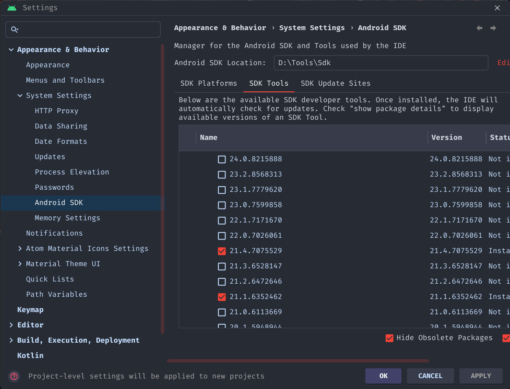
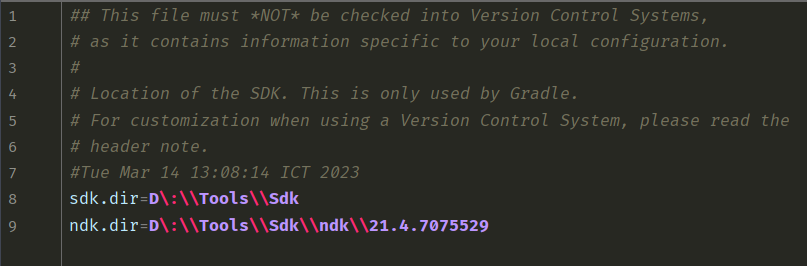
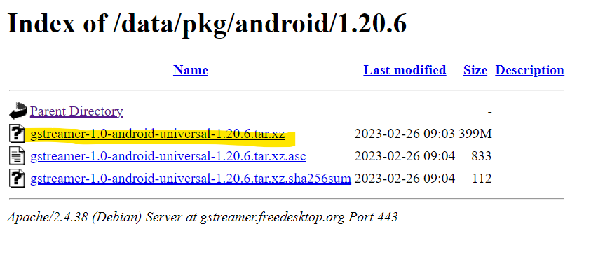
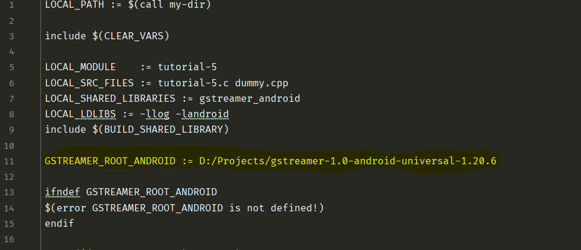
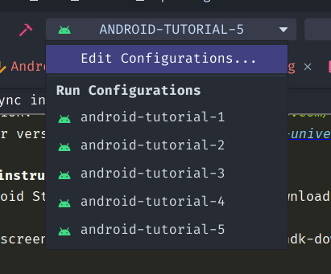
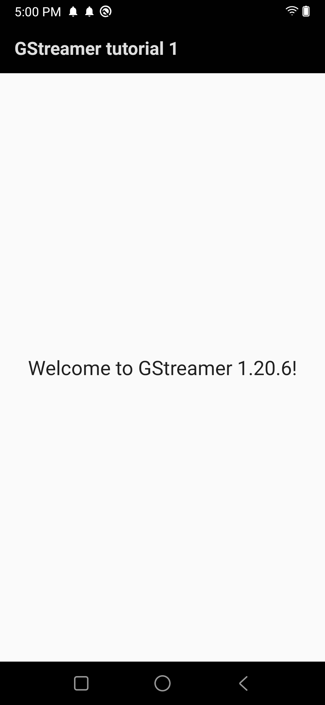
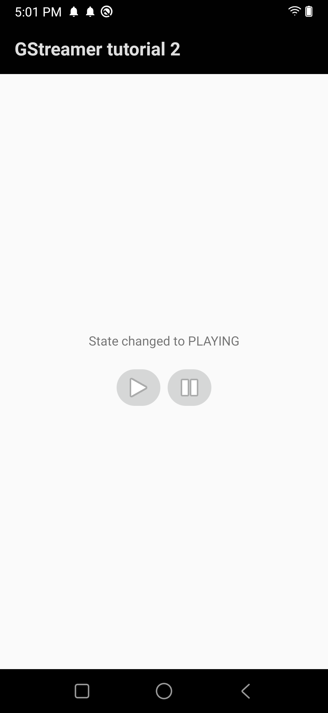
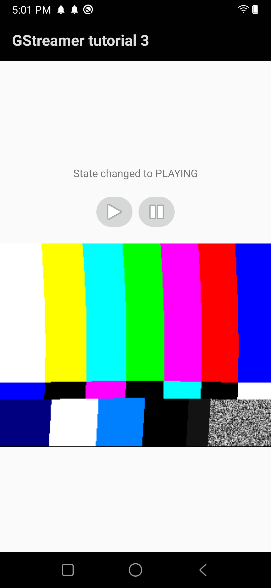
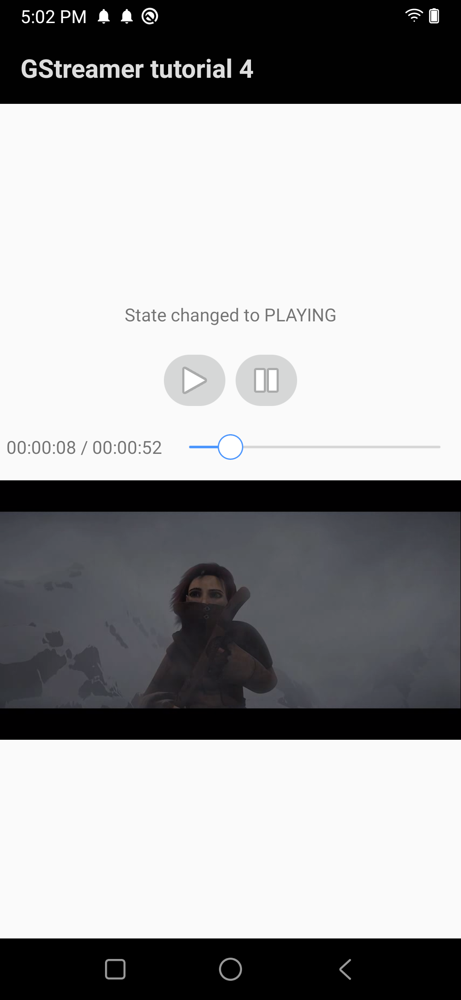
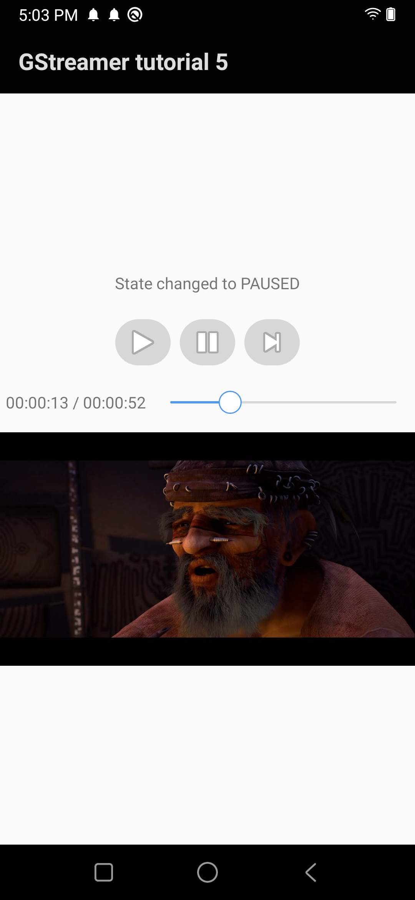

# gstreamer-android-samples

## About the Project 💡

This project collects all Gstreamer android tutorials from **[Gstreamer official site](https://gstreamer.freedesktop.org/documentation/tutorials/android/index.html?gi-language=c#)** and add support for newer SDK version and fully translate into **[Kotlin](https://developer.android.com/kotlin/first)**.

🚀**Technical specification**:
* Gradle distribution and build tool version: **[7.5](https://docs.gradle.org/7.5/release-notes.html)**
* NDK version: **[21.4.7075529](https://github.com/android/ndk/wiki/Unsupported-Downloads#r21e)**
* Gstreamer version: **[gstreamer-1.0-android-universal-1.20.6](https://gstreamer.freedesktop.org/releases/1.20/)**

## Build instruction ⛏
1. In Android Studio, open SDK manager and download NDK version 21.4.7075529
   

2. Locate and copy the path to the SDK and the above downloaded NDK folder (normally in path/to/your/sdk/ndk), then replace in local.properties:

3. Open this [link](https://gstreamer.freedesktop.org/data/pkg/android/1.20.6/) and download the binaries for Gstreamer android 1.20.6

4. Copy the path to the downloaded Gstreamer root folder and replace the GSTREAMER_ROOT_ANDROID property in jni/Android.mk files in every tutorial module

5. Now select one from the configurations list and run it!

⚠**Note**: The first run for each module usually takes longer for building the native libraries. Stay tuned!🙂

## Screenshots 🖼️

    

